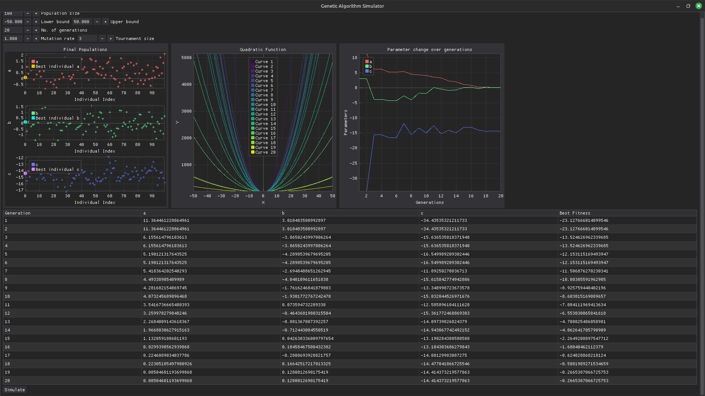

# genetic-algorithm-sim
An interactive simulator that demonstrates the working of genetic algorithms written using Dear PyGui

Written using the [Dear PyGui](https://github.com/hoffstadt/DearPyGui) framework, I wanted to create a fast and highly interactive UI wrapper for a genetic algorithm to optimize a quadratic equation. The goal of the GA is to optimize the coefficients a, b, c such that the parabola generated by the equation is as flat as possible. The GA uses the tournament selection method.
The main goal of this project was to develop a visually comfortable and convenient GUI to tweak and mess around with the GA hyperparameters and see the results quickly without having to re-run the script every single time. I also consider it to be a good learning tool to experiment and understand the workings of the GA

## To-do
- Add the option to select different selection methods such as Roulette Wheel and Elitism
- Do some code clean-up and optimization
- Add the option to choose different curve equations to optimize and options to select the kind of optimization you want to do
